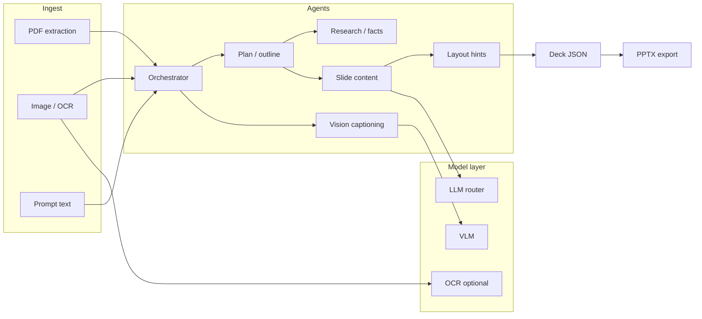

# Traning_app — Product and Technical Draft

## Goal

Deliver an experience similar to [presentations.ai](https://app.presentations.ai) for **education-focused decks**: text and file input, multi-step agent flow, slide editor, **Export as PPT**, and understanding visuals (OCR / vision captioning / safe text placement on layouts).

This repository contains **only multi-model orchestration and agent pipeline code**. The admin UI and existing admin stack integrate via the **[admin_pan](https://github.com/selcuk-yalcin/admin_pan)** submodule; duplicate admin code is not implemented here.

## Scope (this repo)

| Area | In scope | Out of scope (admin_pan / other service) |
|------|-----------|----------------------------------------|
| Orchestrator (planning, task splitting, model selection) | Yes | — |
| Text + image + PDF ingestion pipeline | Yes | — |
| Slide schema (JSON), layout hints, content generation | Yes | — |
| PPTX export (server or worker) | Yes | — |
| Users/roles, billing, general CMS | No | admin_pan |
| Full UI shell (template gallery, workspace settings) | Optional minimal demo | Production UI via admin_pan |

## Reference UX (screens)

- **Entry:** “Describe your deck, or upload a file”; slide count, model tier (Standard / Pro / Ultra), role/language.
- **Agent progress:** “Thinking” sub-tasks, stages like “Deep researching”; live updates via SSE or polling.
- **Editor:** Slide list on the left, 16:9 canvas center, top Undo/Redo, Present, **Export as PPT**; bottom Insert / Remix / Theme.
- **Templates:** Category filters (Education, Business, …) — template metadata can live here as schema + samples.

## Architecture overview: agentic + multi-model

- **Orchestrator:** Queues sub-agents per user settings (language, role, slide length, quality tier); emits status events (`thinking`, `researching`, `generating_slide_n`).
- **Multi-model router:** Maps “Standard / Pro / Ultra” or model name → provider and model ID; includes fallback and budget caps.
- **Reading images:** Summaries / bounding-box hints via VLM for uploaded images; OCR + text merge for rasterized PDF pages.
- **Output:** Single source of truth **Deck JSON schema** (slides, blocks, style tokens); consumed by both the frontend and the PPTX builder.

## admin_pan integration

- Git submodule at repo root: `admin_pan/` → `https://github.com/selcuk-yalcin/admin_pan.git`
- API keys, sessions, project lists, and cost controls come from admin_pan; the orchestrator accepts only **authenticated requests** and quota headers.

## Technology preferences (draft)

- **Language:** Python 3.12+ (agents, workers, PPTX) or a thin Node API bridge — Python recommended for heavy lifting (`python-pptx` or equivalent).
- **Queue:** Redis + worker (Celery / RQ / arq) or a managed queue for long jobs.
- **Realtime:** SSE or WebSocket for stage updates.
- **Storage:** Temp files + extracted text/image summaries (S3-compatible or local).

## Risks and first-sprint focus

- Complex layouts rarely match PPTX pixel-perfect; MVP uses a limited template set.
- Multi-model cost; Orchestrator must enforce token and vision-call ceilings.
- Language and terminology consistency for localized educational content (optional “terminology” mini-agent).

---

*Keep this document current at repo root as `DRAFT.md`.*
