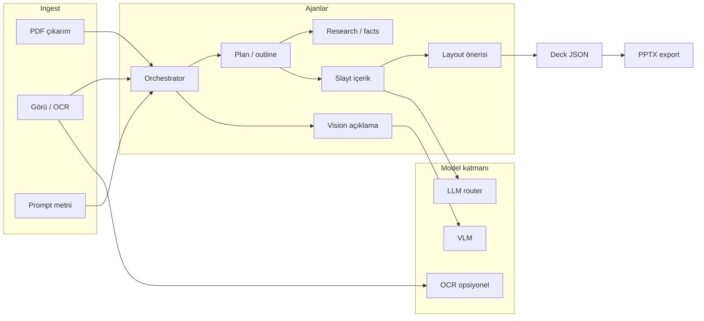

# Traning_app — Ürün ve Teknik Taslak

## Amaç

Eğitim odaklı sunumlar üretmek için, [presentations.ai](https://app.presentations.ai) benzeri bir deneyim: metin ve dosya girişi, çok adımlı “ajan” akışı, slayt düzenleyici, **Export as PPT** ve görsellerin anlaşılması (OCR / görü açıklama / düzen üzerinde güvenli metin yerleşimi).

Bu repoda **yalnızca çok modelli (multi-model) ve ajan orkestrasyonu kodu** bulunur. Yönetim arayüzü ve mevcut admin altyapısı **[admin_pan](https://github.com/selcuk-yalcin/admin_pan)** alt-reposu ile entegre edilir; tekrarlayan admin kodu burada yazılmaz.

## Kapsam (bu repo)

| Alan | Dahil | Hariç (admin_pan / ayrı servis) |
|------|--------|--------------------------------|
| Orchestrator (planlama, görev bölme, model seçimi) | Evet | — |
| Metin + görü + PDF işleme boru hattı | Evet | — |
| Slayt şeması (JSON), layout önerisi, içerik üretimi | Evet | — |
| PPTX export (sunucu veya worker) | Evet | — |
| Kullanıcı/rol, faturalama, genel CMS | Hayır | admin_pan |
| Tam UI shell (şablon galerisi, workspace ayarları) | İsteğe bağlı minimal demo | Üretim UI admin_pan ile |

## Referans UX (ekranlar)

- **Giriş:** “Describe your deck, or upload a file”; slide sayısı, model katmanı (Standard / Pro / Ultra), rol/dil.
- **Ajan ilerlemesi:** “Thinking” alt görevleri, “Deep researching” gibi aşamalar; SSE veya poll ile canlı güncelleme.
- **Editör:** Sol slayt listesi, ortada 16:9 canvas, üstte Undo/Redo, Present, **Export as PPT**; altta Insert / Remix / Theme.
- **Şablonlar:** Kategori filtreleri (Education, Business, …) — şablon meta verisi bu repoda şema + örnekler olarak tutulabilir.

## Mimari özet: ajanik + çok modelli

- **Orchestrator:** Kullanıcı ayarlarına göre (dil, rol, slide uzunluğu, kalite katmanı) alt ajanları sıraya koyar; durum olayları üretir (`thinking`, `researching`, `generating_slide_n`).
- **Multi-model router:** “Standard / Pro / Ultra” veya model adı → gerçek sağlayıcı ve model ID eşlemesi; fallback ve bütçe limitleri.
- **Görü okuma:** Yüklenen görseller için VLM ile özet/sınırlayıcı kutu önerisi; PDF sayfa görselleri için OCR + metin birleştirme.
- **Çıktı:** Tek doğruluk kaynağı olarak **Deck JSON şeması** (slaytlar, bloklar, stil token’ları); hem ön yüz hem PPTX üreticisi bunu tüketir.

## admin_pan entegrasyonu

- Repo kökünde alt-modül: `admin_pan/` → `https://github.com/selcuk-yalcin/admin_pan.git`
- Bu paket: API anahtarları, kullanıcı oturumu, proje listesi, maliyet kontrolleri admin_pan üzerinden gelir; orchestrator sadece **kimlik doğrulaması yapılmış istek** ve kota başlıkları kabul eder.

## Teknoloji tercihleri (taslak)

- **Dil:** Python 3.12+ (ajanlar, worker, PPTX) veya Node için sadece ince bir API köprüsü — asıl ağır iş Python önerilir (`python-pptx` veya benzeri).
- **Kuyruk:** Uzun işler için Redis + worker (Celery / RQ / arq) veya bulut kuyruğu.
- **Gerçek zamanlı:** SSE veya WebSocket ile aşama güncellemeleri.
- **Depolama:** Geçici dosya + çıkarılmış metin/görü özeti (S3 uyumlu veya lokal).

## Riskler ve ilk sprint odakları

- PPTX’te karmaşık layoutların bire bir kayması; MVP’de sınırlı şablon seti.
- Çok modelli maliyet; Orchestrator’da token ve görü çağrısı üst sınırları zorunlu.
- Türkçe eğitim içeriği için dil ve terim tutarlılığı (ayrı bir “terminology” mini ajanı düşünülebilir).

---

*Dosya adı repoyla aynı kökte: `TASLAK.md` — güncel tutun.*
