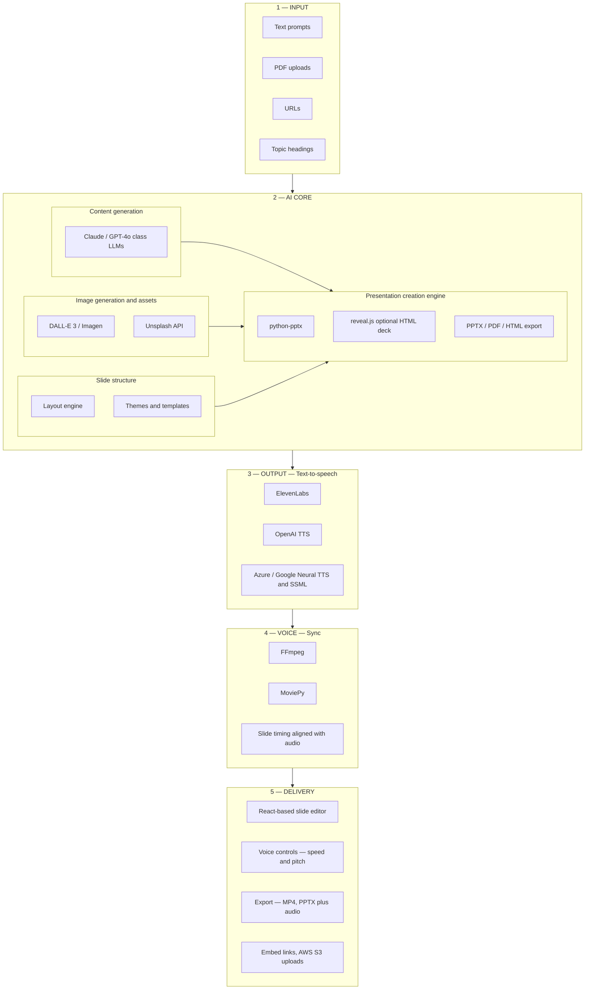

# Product and architecture plan — Traning_app

**Aligned with:** [`SPEC.md`](../SPEC.md) (authoritative).

## Product goal

An **agentic, multimodal** stack that generates **education and training** presentations from mixed inputs, optionally adds **narrated audio**, merges **voice + slides** into timed media, and delivers **editable decks** plus **export/share** artifacts.

This document describes the **end-to-end platform shape** (matching the reference flowchart). Implementation responsibilities stay split: **engine + workers + exporters** in `Traning_app`; **admin shell / React editor hosting** primarily via **`admin_pan`** unless a thin demo lives here.

---

## Training templates (Deep Training UI)

The **Deep Training** fullscreen experience in `admin_pan` (`/deep-training`) is the **template gallery** entry point: users pick a **starter deck** that seeds the education engine (outline, slide structure, and default module copy). Templates are **not** generic marketing layouts; the MVP set is domain-specific for compliance training.

**Ownership**

| Concern | Where it lives |
|---------|----------------|
| Template metadata (title, category, hero image, short description) | React module list on `DeepTrainingFullscreenPage` until a CMS or API exists |
| Canonical slide schemas / Deck JSON defaults | Engine + shared JSON in `Traning_app` per [`SPEC.md`](../SPEC.md) |
| i18n menu label **Deep Training** | `SidebarContent` + `assets/lang/*.json` |

**Creating or extending a template**

1. **Define learning intent** — audience, duration, mandatory topics (e.g. occupational safety vs fire protection), and assessment style (quiz vs acknowledgement).
2. **Author Deck JSON skeleton** — fixed section order (objectives → hazards → controls → procedures → recap); keep placeholders for org-specific policies.
3. **Wire generation prompts** — orchestrator uses template id to select system prompts and slide counts; align with model router tiers.
4. **Add UI card** — new row in the Deep Training `MODULES` array with `category` matching an existing filter or add a filter chip when the catalog grows.
5. **QA** — export PPTX/HTML smoke test, optional TTS segment length check, and terminology consistency in the chosen language.

---

## Reference architecture (five layers)

The platform is organized as **Input → AI Core → Output (TTS) → Voice (sync) → Delivery**. The legend maps concerns to layers: **LLM / presentation engine / voice synthesis / video merge / frontend**.

---

### Layer 1 — Input (user intake)

| Channel | Role |
|---------|------|
| **Text prompts** | Primary instructions: audience, objectives, tone, slide length. |
| **PDF uploads** | Course material, papers — text extraction and optional OCR for scans. |
| **URLs** | Fetch and normalize page content (respect robots and terms of service; may use dedicated fetch + HTML parse pipeline). |
| **Topic headings** | Minimal seed — expand into outline via orchestrator. |

**Engine duties:** validate size/type, strip risky payloads, produce a **unified context document** for downstream agents.

---

### Layer 2 — AI Core

Four cooperating concerns inside the core:

**A. Content generation (LLM layer)**  
- Primary text models in the **Claude** or **GPT-4o** class for outline, slide copy, speaker notes, and education-style progression.  
- Routed through the **model router** (tiers Standard / Pro / Ultra per [`SPEC.md`](../SPEC.md)).

**B. Image generation and stock assets**  
- **Synthetic images:** **DALL-E 3** (OpenAI Images API) or **Google Imagen** (Vertex), chosen per policy and cost.  
- **Stock photography:** **Unsplash API** for licensed hero/background imagery when AI generation is off or as fallback.

**C. Slide structure**  
- **Layout engine:** maps Deck JSON blocks to template regions (title, body, image slots, tables).  
- **Themes and templates:** finite MVP set; metadata can live in-repo as JSON + previews.

**D. Presentation creation engine**  
- **`python-pptx`:** canonical **PPTX** build from Deck JSON.  
- **`reveal.js`:** optional **HTML** slide export or offline-present mode.  
- **Export formats:** **PPTX**, **PDF** (print/static pipeline), **HTML** — not every format must ship in v1; prioritize PPTX then MP4 story below.

---

### Layer 3 — Output (text-to-speech)

Narration for slides or full-deck voice track. Pick **one primary** provider per product SKU; keep adapters swappable.

| Provider | Role |
|----------|------|
| **ElevenLabs** | High realism, strong multilingual; typical commercial pricing model (plan cost per character). |
| **OpenAI TTS** | Fewer voices, fast and economical for bulk narration. |
| **Azure Speech / Google Cloud TTS** | Enterprise, SSML control, regional compliance. |

Configuration aligns with root **`.env.example`**: `ELEVENLABS_API_KEY`, OpenAI key reuse for TTS, optional Azure keys.

---

### Layer 4 — Voice (audio + slide synchronization)

**Purpose:** combine generated **audio segments** with **slide timelines** into a single playable artifact.

| Tool | Role |
|------|------|
| **FFmpeg** | Encode muxed output (**MP4**), normalize loudness, concat segments. |
| **MoviePy** | Optional higher-level timeline edits when Python orchestration is simpler than raw FFmpeg scripts. |

**Sync model:** per-slide or per-scene audio duration drives slide visibility timestamps in the video; edge cases (long text vs short slide) handled by pacing rules or SSML breaks upstream.

---

### Layer 5 — Delivery (frontend and sharing)

| Piece | Role |
|-------|------|
| **React-based slide editor** | Aligns with **`admin_pan`** frontend stack where applicable; canvas, thumbnails, undo/redo, insert/remix/theme patterns from product UX references. |
| **Voice adjustment UI** | Speed and pitch (and provider-specific controls when exposed by API). |
| **Export and sharing** | **MP4** full narration video; **PPTX with embedded or linked audio** where supported; **embed links** for hosted playback; **AWS S3** (or compatible) for durable asset URLs — matches `.env.example` S3 variables. |

---

## Architecture baseline (this repository)

- **Orchestrator:** state machine — planning → research/synthesis → slide generation → layout → optional **TTS queue** → optional **render job**; emits events for streaming UIs.  
- **Ingest:** PDF, images, URLs, prompts → unified context; **VLM** for image understanding and safe text regions.  
- **Model router:** tiered LLM + vision + image-gen + TTS adapters; strict budgets.  
- **Canonical artifact:** **Deck JSON** → **python-pptx** / optional reveal export → optional **audio manifest** → FFmpeg/MoviePy **MP4**.

---

## Boundaries

| Layer segments | `Traning_app` (this repo) | `admin_pan` / client apps |
|----------------|---------------------------|---------------------------|
| Input ingestion, AI core orchestration, PPTX/HTML export, TTS job invocation, FFmpeg/MoviePy workers | Primary ownership | Consumes APIs |
| React editor shell, org-wide admin, billing UX | Thin demo only if needed | Primary ownership |
| S3 buckets / CDN | Worker writes via configured credentials | May own IAM policies and public URLs |

---

## Quality bar for education content

- Logical lesson flow (objectives → concepts → examples → recap; optional short check).  
- Consistent terminology within a generation run when language is fixed.  
- When voice is enabled: intelligible pacing and slide boundaries suitable for learners.
