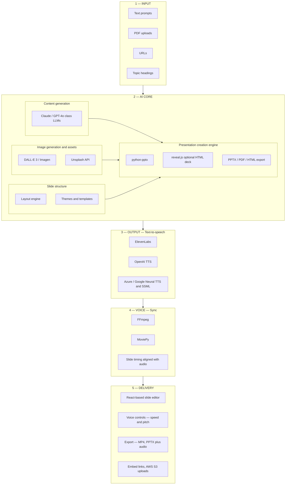

# Product and architecture plan — Traning_app

**Aligned with:** [`SPEC.md`](../../../SPEC.md) (authoritative).

## Product goal

An **agentic, multimodal** stack that generates **education and training** presentations from mixed inputs, optionally adds **narrated audio**, merges **voice + slides** into timed media, and delivers **editable decks** plus **export/share** artifacts.

This document describes the **end-to-end platform shape** (matching the reference flowchart). Implementation responsibilities stay split: **engine + workers + exporters** in `Traning_app`; **admin shell / React editor hosting** primarily via **`admin_pan`** unless a thin demo lives here.

## Implementation durumu (özet)

| Parça | Durum | Not |
|--------|--------|-----|
| Monorepo `training_app/` | ✅ Tamamlandı | Motor kökü ayrı klasör |
| `engine/agents` + `pipeline.run_job` | ✅ Tamamlandı | L2–L3 tek paket |
| **Layer 1** — birleşik context, doğrulama, URL fetch, PDF (pypdf), intake meta | ✅ Tamamlandı | `engine/ingest/` |
| API `POST /presentations/generate` + CORS | ✅ Tamamlandı | `api/main.py`, `routes/presentations.py` |
| Deep Training şablon galerisi | ✅ Tamamlandı | `/deep-training` |
| Create project 5 adımlı sihirbaz | ✅ Tamamlandı | [`roadmap.md` § Create project](./roadmap.md#create-project-flow), `/create-project` |
| **Layer 2** — vision, görsel, stok, router, tema, PPTX/HTML | ✅ Tamamlandı | `agents/vision.py`, `image_synthetic.py`, … |
| **Layer 3** — TTS + ses manifesti | ✅ Tamamlandı | `tts*.py`, `audio_manifest.py`, `use_tts` |
| **OpenRouter** — tek anahtar, LLM + vision + image + TTS | ✅ Tamamlandı | `OPENROUTER_API_KEY`, `openrouter_client.py`, `router.resolve_*` |
| L4 MP4 mux (FFmpeg + slayt başına TTS) | ✅ MVP | `media/sync.py`, `tts_segments.py`, `GET …/export/mp4` |
| Slayt AI görselleri (`use_slide_images`) | ✅ MVP | `agents/slide_images.py` |
| Create project SSE (Adım 3) | ✅ | `events/stream` + poll yedek |
| L5 tam slide editör + paylaşım | ✅ Tamamlandı | `CreateProjectPage` canvas, tema/ses/paylaş panelleri, Sunum, `PUT /deck`, `embed/html`, slayt görseli API |
| **L5+ Slayt player** — kayan yazı, animasyon, accordion, geçişler, element-senkron ses, ilerleme, quiz, mobil | ⏳ Planlandı | [§ Slayt deneyimi](#slayt-player-l5) + Deck JSON / `html_export` / embed |
| **HTML slayt fabrikası** — slides.com / RCA tarzı şablonlar, tek HTML, layout motoru | ⏳ Planlandı | [§ HTML slayt fabrikası](#html-slide-factory) — `html_export`, `layout_id` |
| admin_pan auth / kota sözleşmesi | ⏳ Beklemede | `roadmap.md` Phase E |
| CI güvenlik + entegrasyon matrisi | ⏳ Beklemede | `roadmap.md` Phase D |

### Sıradaki işler (öncelik)

1. **HTML slayt fabrikası** — Şablon kataloğu (Desk/RCA), `html_export` genişletmesi, player kabuğu; bkz. [HTML slayt fabrikası](#html-slide-factory).
2. **Slayt deneyimi (L5+)** — Kayan yazılar, fade-in, accordion, geçişler, element bazlı ses, ilerleme, quiz, mobil; bkz. [§ Slayt deneyimi](#slayt-player-l5).
3. **Remix** — Tek slaytı LLM ile yeniden üretme (motor endpoint).
4. **S3** — Export artefact’larını kalıcı URL’ye yazma.
5. **Pitch** — OpenAI/ElevenLabs gerçek pitch parametresi (şu an yalnızca tarayıcı `playbackRate`).

---

## OpenRouter — model önerileri (görsel + TTS)

Tek faturalandırma ve model değişimi için **`OPENROUTER_API_KEY`** yeterli; motor önce OpenRouter’ı, yoksa doğrudan OpenAI’ı kullanır (`.env.example`).

### Metin / planlama (tier)

| Tier | Önerilen model ID | Kullanım |
|------|-------------------|----------|
| Standard | `openai/gpt-4o-mini` | Outline, kısa slayt metni, düşük maliyet |
| Pro | `openai/gpt-4o` | Daha tutarlı eğitim dili, orta uzunluk |
| Ultra | `anthropic/claude-sonnet-4` | Uzun bağlam, karmaşık kaynak sentezi |

Env: `MODEL_TIER_STANDARD`, `MODEL_TIER_PRO`, `MODEL_TIER_ULTRA`.

### Vision (kaynak görsel / PDF sayfası okuma)

| Öneri | Model ID | Not |
|--------|----------|-----|
| Varsayılan | `google/gemini-2.5-flash` | Hızlı multimodal; TR/EN iyi |
| Alternatif | `openai/gpt-4o` | Mevcut OpenAI uyumluluğu |

Env: `VISION_MODEL_OPENAI` (OpenRouter ID kabul eder).

### Görsel üretim (slayt kapak / illüstrasyon)

OpenRouter: `POST /chat/completions` + `modalities: ["image"]`, `image_config.aspect_ratio: "16:9"`.

| Tier | Önerilen model ID | Neden |
|------|-------------------|--------|
| Standard | `google/gemini-2.5-flash-image` | Hızlı, eğitim slaytı için yeterli, 16:9 |
| Pro | `google/gemini-3.1-flash-image-preview` | Daha net tipografi / diyagram |
| Ultra | `black-forest-labs/flux.2-pro` | Fotogerçekçi kapak görselleri |
| Bütçe (sabit fiyat) | `bytedance/seedream-4.5` | ~$0.04/görsel (OpenRouter fiyat listesi) |

Env: `OPENROUTER_IMAGE_MODEL` (tüm tier’lar için tek override) veya kod içi tier eşlemesi (`router.resolve_image_model`).

Kod: `agents/image_synthetic.py` → OpenRouter dalı; yoksa `OPENAI_IMAGE_MODEL=dall-e-3`.

### TTS (anlatım)

OpenRouter: `POST /audio/speech` (OpenAI Speech API uyumlu).

| Senaryo | Önerilen model ID | Not |
|---------|-------------------|-----|
| Varsayılan (TR/EN, ekonomik) | `openai/gpt-4o-mini-tts-2025-12-15` | ~$0.60 / 1M karakter |
| Çok dilli / voice clone | `mistralai/voxtral-mini-tts-2603` | Daha pahalı; özel ses ihtiyacında |
| Doğrudan OpenAI (OpenRouter kapalı) | `tts-1` + `OPENAI_TTS_VOICE=alloy` | Mevcut `tts_openai.py` yolu |

Env: `OPENROUTER_TTS_MODEL`. Ses adı: `OPENAI_TTS_VOICE` (OpenAI TTS sesleri; OpenRouter modeline göre dokümantasyondan doğrulanmalı).

Kod: `agents/tts_openai.py` + `router.resolve_tts_model()`.

### OpenRouter ortam değişkenleri (minimum)

```bash
OPENROUTER_API_KEY=sk-or-...
OPENROUTER_HTTP_REFERER=https://your-app.example
OPENROUTER_SITE_URL=Deep Training
MODEL_TIER_STANDARD=openai/gpt-4o-mini
MODEL_TIER_PRO=openai/gpt-4o
MODEL_TIER_ULTRA=anthropic/claude-sonnet-4
VISION_MODEL_OPENAI=google/gemini-2.5-flash
OPENROUTER_IMAGE_MODEL=google/gemini-2.5-flash-image
OPENROUTER_TTS_MODEL=openai/gpt-4o-mini-tts-2025-12-15
```

Modelleri güncellemek için: [openrouter.ai/models](https://openrouter.ai/models) → filtre `output_modalities=image` veya `speech`.

---

## Training templates (Deep Training UI)

The **Deep Training** fullscreen experience in `admin_pan` (`/deep-training`) is the **template gallery** entry point: users pick a **starter deck** that seeds the education engine (outline, slide structure, and default module copy). Templates are **not** generic marketing layouts; the MVP set is domain-specific for compliance training.

**Ownership**

| Concern | Where it lives |
|---------|----------------|
| Template metadata (title, category, hero image, short description) | React module list on `DeepTrainingFullscreenPage` until a CMS or API exists |
| Canonical slide schemas / Deck JSON defaults | Engine + shared JSON in `Traning_app` per [`SPEC.md`](../../../SPEC.md) |
| i18n menu label **Deep Training** | `SidebarContent` + `assets/lang/*.json` |
| **Create project** çok adımlı akış (referans UI) | [`roadmap.md` § Create project](./roadmap.md#create-project-flow) + `admin_pan` `/create-project` |

**Creating or extending a template**

1. **Define learning intent** — audience, duration, mandatory topics (e.g. occupational safety vs fire protection), and assessment style (quiz vs acknowledgement).
2. **Author Deck JSON skeleton** — fixed section order (objectives → hazards → controls → procedures → recap); keep placeholders for org-specific policies.
3. **Wire generation prompts** — orchestrator uses template id to select system prompts and slide counts; align with model router tiers.
4. **Add UI card** — new row in the Deep Training `MODULES` array with `category` matching an existing filter or add a filter chip when the catalog grows.
5. **QA** — export PPTX/HTML smoke test, optional TTS segment length check, and terminology consistency in the chosen language.

---

## Reference architecture (five layers)

The platform is organized as **Input → AI Core → Output (TTS) → Voice (sync) → Delivery**. The legend maps concerns to layers: **LLM / presentation engine / voice synthesis / video merge / frontend**.



---

### Layer 1 — Input (user intake) — **tamamlandı** (`traning_app/engine/ingest/`)

| Channel | Role |
|---------|------|
| **Text prompts** | Primary instructions: audience, objectives, tone, slide length. |
| **PDF uploads** | Course material, papers — text extraction and optional OCR for scans. |
| **URLs** | Fetch and normalize page content (respect robots and terms of service; may use dedicated fetch + HTML parse pipeline). |
| **Topic headings** | Minimal seed — expand into outline via orchestrator. |

**Engine duties (uygulama):** `validation.py` ile tip/sayı sınırları; `intake.resolve_sources_for_job` ile URL genişletme ve `pdf_base64` → metin; `context.build_unified_context` ile tek belge; `pdf.py` / `url.py` / `html_plain.py` ile çıkarım ve HTML sadeleştirme.

---

### Layer 2 — AI Core — **tamamlandı** (LLM + vision + görsel + tema + export; tam layout editörü değil)

Four cooperating concerns inside the core:

**A. Content generation (LLM layer)**  
- Primary text models in the **Claude** or **GPT-4o** class for outline, slide copy, speaker notes, and education-style progression.  
- Routed through the **model router** (tiers Standard / Pro / Ultra per [`SPEC.md`](../../../SPEC.md)).

**B. Image generation and stock assets**  
- **Synthetic images:** **DALL-E 3** (OpenAI Images API) or **Google Imagen** (Vertex), chosen per policy and cost.  
- **Stock photography:** **Unsplash API** for licensed hero/background imagery when AI generation is off or as fallback.

**C. Slide structure**  
- **Layout engine:** maps Deck JSON blocks to template regions (title, body, image slots, tables).  
- **Themes and templates:** finite MVP set; metadata can live in-repo as JSON + previews.

**D. Presentation creation engine**  
- **`python-pptx`:** canonical **PPTX** build from Deck JSON.  
- **`reveal.js`:** optional **HTML** slide export or offline-present mode.  
- **Export formats:** **PPTX**, **PDF** (print/static pipeline), **HTML** — not every format must ship in v1; prioritize PPTX then MP4 story below.

---

### Layer 3 — Output (text-to-speech) — **tamamlandı** (OpenAI / ElevenLabs TTS + ses manifesti; Azure/Google stub)

Narration for slides or full-deck voice track. Pick **one primary** provider per product SKU; keep adapters swappable.

| Provider | Role |
|----------|------|
| **ElevenLabs** | High realism, strong multilingual; typical commercial pricing model (plan cost per character). |
| **OpenAI TTS** | Fewer voices, fast and economical for bulk narration. |
| **Azure Speech / Google Cloud TTS** | Enterprise, SSML control, regional compliance. |

Configuration aligns with root **`.env.example`**: `ELEVENLABS_API_KEY`, OpenAI key reuse for TTS, optional Azure keys.

---

### Layer 4 — Voice (audio + slide synchronization) — **MVP tamamlandı**

**Purpose:** combine generated **audio segments** with **slide timelines** into a single playable artifact.

| Tool | Role |
|------|------|
| **FFmpeg** | Encode muxed output (**MP4**), normalize loudness, concat segments. |
| **MoviePy** | Optional higher-level timeline edits when Python orchestration is simpler than raw FFmpeg scripts. |

**Sync model:** `manifest_from_deck_notes` → `synthesize_manifest_audio` (gerçek MP3 + `ffprobe` süre) → `render_mp4` (FFmpeg: renk karesi + ses, concat). API: `use_tts` + `use_video`, `GET /presentations/{id}/export/mp4`.

**Sync model (ileri):** slayt görsellerini video karelerine bindirmek; SSML ile pacing.

---

### Layer 5 — Delivery (frontend and sharing) — **tamamlandı** (admin_pan + API)

| Piece | Role |
|-------|------|
| **React slide editor** | `/create-project` Adım 5: 16:9 canvas, tema tokenları, geri al/yinele, slayt ekle/çoğalt/sil, alan düzenleme. |
| **Presenter** | Tam ekran sunum; oklar, Esc. |
| **Voice UI** | Ses paneli: slayt TTS önizleme + tarayıcı `playbackRate` (pitch API henüz yok). |
| **Export + paylaşım** | PPTX, HTML, MP4; `GET /embed/html` ve iframe snippet; `PUT /deck` ile kalıcı düzenleme. |
| **Slayt görseli** | `GET /slides/{i}/image` ile önizleme. |
| **Sonraki** | Remix, S3, PPTX’e gömülü ses; [etkileşimli player](#slayt-player-l5); [HTML şablon fabrikası](#html-slide-factory). |

---

<a id="slayt-player-l5"></a>

## Slayt deneyimi (player & etkileşim, L5+)

Eğitim sunumlarının **yayınlanan** ve **gömülen** sürümlerinde (`embed/html`, ileride özel player route) aşağıdaki yetenekler hedeflenir. Öncelik: **HTML/Web player** ve **Deck JSON genişletmesi**; PPTX tarafı sınırlı kalır (animasyon / tıklama davranışı Office’te farklı).

| Özellik | Açıklama | Teknik not |
|---------|-----------|------------|
| **Kayan yazılar** | Başlık bandı veya alt bilet (ticker) metni | Deck’te isteğe bağlı `marquee` / `ticker` blokları; CSS `animation` veya `marquee` benzeri JS; erişilebilirlik için `prefers-reduced-motion` ile sadeleştirme |
| **Fade-in animasyonlar** | Başlık, madde işaretleri, görseller için görünürlük animasyonu | Slayt / blok `animations`: `{ type: "fade-in", delay_ms, stagger_ms }`; CSS `@keyframes` + `IntersectionObserver` veya Reveal.js plugin |
| **Tıklanınca açılan metin / accordion** | Ek açıklama, yasal metin, “daha fazla oku” | Blok tipi `accordion` / `disclosure`: `summary`, `body`, `defaultExpanded`; native `<details>` veya ARIA accordion |
| **Slayt geçiş efektleri** | Slide → slide geçişi | Player config: `transition: fade|slide|zoom|none`; Reveal.js `transition` veya özel view transitions API (desteklenen tarayıcılarda) |
| **Ses anlatı senkronizasyonu (element bazlı)** | Her başlık / madde / kutunun zaman damgasına göre vurgulanması veya sırayla gösterilmesi | `audio_manifest` veya slayt içi `timeline[]`: `{ element_id, start_sec, end_sec }`; `AudioContext` + `requestAnimationFrame` veya WebVTT benzeri cue listesi; TTS üretiminde cue üretimi için motor tarafı genişletme |
| **İlerleme takibi** | Kullanıcının hangi slayta kadar izlediği | `localStorage` / `sessionStorage` (anonim) veya oturum açıksa `POST /progress` (admin_pan); `deck_id`, `last_slide_index`, `completed_at` |
| **Quiz / soru** | Slayta gömülü tek doğru / çoktan seçmeli, doğrulama | Deck’te `type: "quiz"`: `question`, `options[]`, `correct_index` veya `acceptable_answers[]`; player’da cevap sonrası geri bildirim; raporlama isteğe bağlı API |
| **Mobil uyum** | Dokunmatik, küçük ekran, yatay/dikey | Viewport meta, `touch-action`, alt navigasyon, font/ölçek tokenları; 16:9 korunurken `min-height` ve kaydırılabilir içerik |

**Sahiplik:** Player UI ve etkileşim kodu ağırlıklı **`admin_pan`** veya embed edilen **statik HTML + JS** (`engine/agents/html_export.py` çıktısı genişletilir). **Deck JSON şeması** (`engine/deck/schema.py`, SPEC) yeni blok tipleri ve `timeline` / `quiz` alanlarını tanımlar. **İlerleme API** motor veya admin backend’de ortak sözleşme ile netleştirilir.

---

<a id="html-slide-factory"></a>

## HTML slayt fabrikası (tek dosya + slayt koleksiyonu)

**Hedef:** Deck JSON ve tema tokenlarından, **slides.com** tarzı düzenli, **modal önizleme** hissi veren (oklar, alt ilerleme çubuğu, tipografi hiyerarşisi) ve **RCA / DeepWhy** tarzı **sol dikey akış + sağ çalışma alanı** (isteğe bağlı shell) ile **tek HTML** veya **çok slaytlı web deck** üretmek. Referans görseller workspace’te:  
`~/.cursor/projects/Users-selcuk-Traning-app/assets/Screenshot_2026-05-16_at_02.54.49-*.png` (RCA akış), `..._01.02.*` (Desk benzeri şablonlar: başlık kutusu, iki sütun, fiyatlandırma, zaman çizelgesi).

### Mimari

| Katman | Görev |
|--------|--------|
| **Şablon kataloğu** | `layout_id` veya `slide.skin`: `desk_hero`, `desk_split`, `desk_pricing`, `desk_timeline`, `desk_quote` — her biri için HTML/CSS snippet + yer tutucu alanlar (`title`, `body`, `columns[]`, `milestones[]`, `plans[]`). |
| **Layout motoru** | `html_export.py` (veya `engine/layout/html_templates.py`): Deck → her slayt için `section` + BEM sınıfları; tema JSON → CSS değişkenleri (`--color-primary`, `--font-heading`). |
| **Player kabuğu** | Reveal.js veya hafif özel: **ileri/geri** chevron, **alt progress bar** (mevcut slayt / toplam), tam ekran; mobilde dikey stack + dokunma swipe. |
| **İş akışı shell (opsiyonel)** | Eğitim / RCA senaryolarında: sol **“Akış adımları”** stepper + sağ içerik — `admin_pan` route veya HTML içinde `data-mode="wizard"` ile aynı CSS tasarım dili. |
| **Çıktı** | `GET …/export/html` / `embed/html`: tek `index.html` + inline CSS/JS veya CDN (Reveal); ileride ayrı `slides/` klasörü + asset URL’leri (S3). |

### Şablon → slayt eşlemesi (örnek)

| Görsel referans | `slide.type` / `layout_id` | Ana bloklar |
|-----------------|----------------------------|-------------|
| Koyu başlık kutusu + gövde (“Get In Touch”, “Our Story”) | `desk_hero` veya `title` + `skin` | `title`, `subtitle` / `body`, isteğe bağlı `accent_offset` (gölge katmanı) |
| Sol metin + sağ foto (“Customers”, “Philosophy”) | `desk_split` / `two_column` | `image_url` veya `image_path`, `quote`, `attribution` |
| Üç sütun fiyat kartı | `desk_pricing` | `plans[]`: `{ name, price_label, features: [{ text, included }] }` |
| Yatay zaman çizelgesi (alternatif üst/alt) | `desk_timeline` | `milestones[]`: `{ order, text, position: "above"|"below" }` |
| Sol dikey adımlar + sohbet alanı | `flow_shell` (UI only) | `steps[]`, `active_step_index`; içerik ayrı route veya iframe embed |

### Üretim boru hattı

1. **LLM / şablon** — Outline veya `bullets` içeriğini `layout_id` ile eşleştir (kurallı eşleme veya model önerisi).  
2. **Token birleştirme** — `apply_theme_to_deck` sonrası `meta.theme` → CSS `:root`.  
3. **Render** — Jinja2 benzeri string şablon veya Python f-string ile güvenli `html.escape`; görseller için mevcut `image_path` / URL.  
4. **Doğrulama** — Tek HTML’de script CSP uyumu; `prefers-reduced-motion` ile animasyon kapatma.

### İlişki

Bu bölüm, üstteki [Slayt deneyimi (L5+)](#slayt-player-l5) tablosunun **görsel ve yapısal** temelini tanımlar; animasyon / accordion / senkron ses orada detaylanır. **PPTX** aynı Deck’ten üretilmeye devam eder; zengin HTML yalnızca web / embed kanalında tam güçlüdür.

---

## Architecture baseline (this repository)

- **Orchestrator:** state machine — planning → research/synthesis → slide generation → layout → optional **TTS queue** → optional **render job**; emits events for streaming UIs (`traning_app/engine/orchestrator/`).  
- **Ingest:** PDF, images, URLs, prompts → unified context; **VLM** for image understanding and safe text regions (`traning_app/engine/ingest/`).  
- **Model router:** tiered LLM + vision + image-gen + TTS adapters; strict budgets (`traning_app/engine/agents/` — düz modüller: `router.py`, `llm.py`, `tts*.py`, vb.).  
- **Canonical artifact:** **Deck JSON** → **python-pptx** / optional reveal export → optional **audio manifest** → FFmpeg/MoviePy **MP4** (`traning_app/engine/deck`, `agents/pptx_export.py`, `agents/html_export.py`, `agents/audio_manifest.py`, `engine/media`).

---

## Python package layout (motor = ``engine/``)

Tüm sunum motoru (L1 ingest, deck, orchestrator, **agents** tek klasörde L2+L3 mantığı, L4 media, workers ve geçiş shim’leri) **tek paket kökünde**: ``traning_app/engine/``. Üst düzeyde yalnızca **API** ve **config** (ve paket verisi ``templates/``) kalır; klasör karmaşası azalır.

| Plan layer | Package path | Responsibility |
|------------|----------------|------------------|
| **L1 — Input** | `traning_app/engine/ingest/` | PDF, URL, görsel, birleşik context. |
| **L2 + L3 — AI + TTS** | `traning_app/engine/agents/` | Tek giriş: `pipeline.py` (`run_job`). Düz modüller: `llm.py`, `router.py`, `vision.py`, `image_*.py`, `theme.py`, `deck_theme.py`, `pptx_export.py`, `html_export.py`, `audio_manifest.py`, `tts.py`, `tts_*.py`. |
| **L4 — Mux** | `traning_app/engine/media/` | FFmpeg/MoviePy birleştirme (gelecek). |
| **Orchestration** | `traning_app/engine/orchestrator/` | İş akışı, job store; runner → `agents.pipeline`. |
| **Deck model** | `traning_app/engine/deck/` | Şema, şablon yükleyici, katalog. |
| **Events** | `traning_app/engine/events/` | Ajan olay tipleri. |
| **Workers** | `traning_app/engine/workers/` | Arka plan görev girişleri. |
| **Shims (compat)** | `traning_app/engine/providers/`, `layout/`, `export/` | Eski import yollarına yönelik ince yönlendirme (`agents` altına). |

**Örnek importlar:** ``from traning_app.engine.agents import run_job, apply_theme_to_deck`` · ``from traning_app.engine.agents.pptx_export import deck_to_pptx`` · ``from traning_app.engine.ingest.context import build_unified_context``

---

## Boundaries

| Layer segments | `Traning_app` (this repo) | `admin_pan` / client apps |
|----------------|---------------------------|---------------------------|
| Input ingestion, AI core orchestration, PPTX/HTML export, TTS job invocation, FFmpeg/MoviePy workers | Primary ownership | Consumes APIs |
| React editor shell, org-wide admin, billing UX | Thin demo only if needed | Primary ownership |
| S3 buckets / CDN | Worker writes via configured credentials | May own IAM policies and public URLs |

---

## Quality bar for education content

- Logical lesson flow (objectives → concepts → examples → recap; optional short check).  
- Consistent terminology within a generation run when language is fixed.  
- When voice is enabled: intelligible pacing and slide boundaries suitable for learners.
